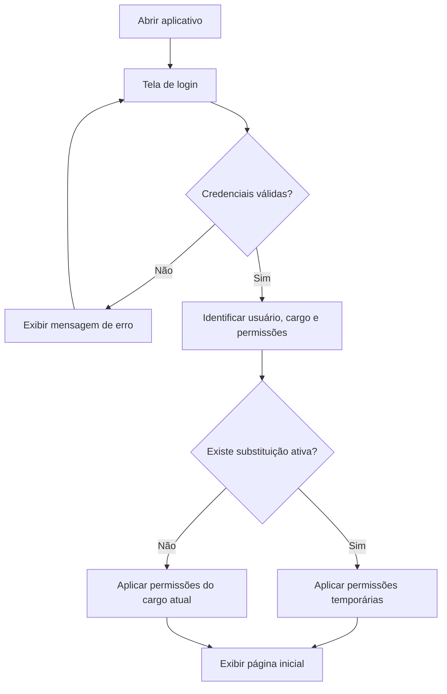

# Fluxo de navegação do Gabinete+

## 1. Objetivo

Este documento descreve a estrutura inicial de navegação do aplicativo Gabinete+, considerando os seguintes perfis:

- Magistrado gestor;
- Assessor-chefe de gabinete;
- Assessor 1;
- Assessor 2;
- Assessor substituto.

A interface e as ações disponíveis deverão variar conforme o cargo atual, as permissões atribuídas e a existência de substituição temporária.

O sistema deverá permitir que uma pessoa mude de cargo ao longo do tempo, sem perder o histórico de tarefas, atividades, substituições e responsabilidades anteriormente exercidas.

---

## 2. Estrutura principal

Após o login, o usuário poderá acessar os seguintes módulos:

1. Início;
2. Tarefas;
3. Atividades;
4. Equipe;
5. Substituições;
6. Relatórios;
7. Perfil e configurações.

Nem todos os módulos serão exibidos para todos os perfis.

A exibição dependerá das permissões do cargo e de eventual substituição ativa.

---

## 3. Fluxo de autenticação

